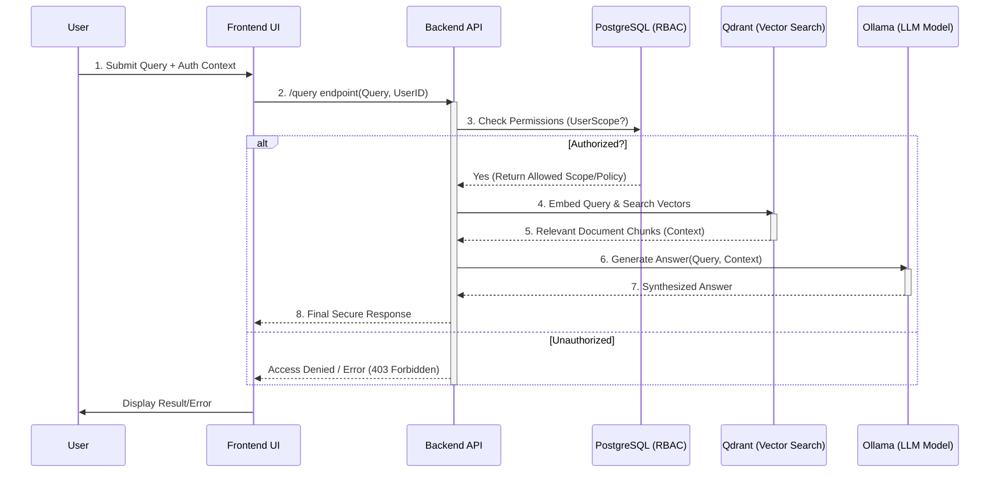
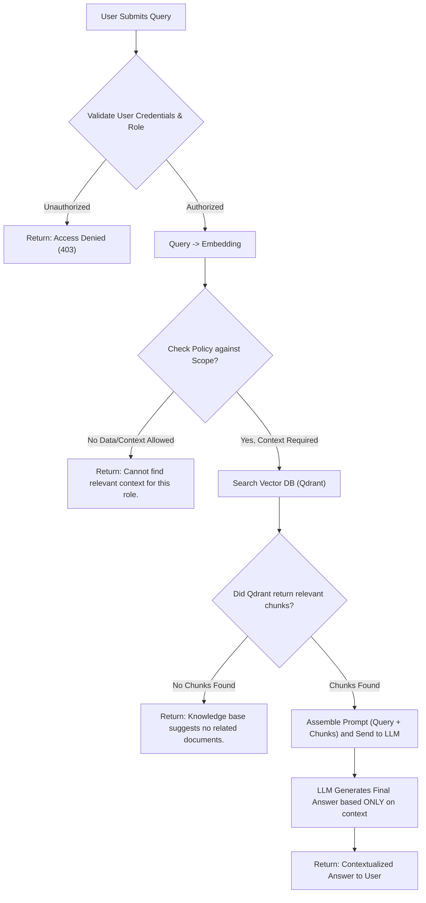

# 🧠 RBAC-RAG: Enterprise Knowledge Management System

## Overview

RBAC-RAG is a comprehensive, secure knowledge management platform designed for enterprise environments. It solves the challenge of making vast amounts of organizational knowledge searchable and accessible while strictly enforcing **Role-Based Access Control (RBAC)**.

By combining Retrieval-Augmented Generation (RAG) with robust access control mechanisms, RBAC-RAG ensures that users only receive accurate answers based on documents they are authorized to view. Instead of basic search, users get contextual, synthesized knowledge answers generated by a Large Language Model (LLM).

---

## ✨ Key Features

### 📚 Knowledge Retrieval (RAG)
*   **Semantic Search:** Documents are chunked and embedded into a vector database (Qdrant), enabling semantic searches that understand the *meaning* of queries, not just keywords.
*   **Contextual Generation:** The system retrieves the most relevant knowledge snippets from proprietary documents and passes them to an LLM for accurate answer generation, drastically reducing hallucinations.

### 🔒 Role-Based Access Control (RBAC)
*   **Granular Permissions:** Every piece of data and every query result is filtered based on user roles, departments, and explicit permissions managed via PostgreSQL.
*   **Data Segregation:** Users are guaranteed to only see information they are authorized to access, critical for maintaining security in an enterprise setting.

### 💻 Modern Web Interface
*   The system features a responsive frontend allowing users to interact with the knowledge base through a clean, intuitive chat interface.

---

## ⚙️ Architecture & Technology Stack

RBAC-RAG is a microservices architecture deployed via `docker-compose`, ensuring scalability and modularity.

### Component Breakdown:
1.  **Frontend (UI):** The client-facing application that handles user interactions and displays results.
2.  **Backend API:** The core business logic layer. It acts as an orchestrator, managing the flow of a query—from validation and RBAC checking to invoking vector search and LLM generation.
3.  **PostgreSQL (Relational DB):** Stores structured data, including user profiles, roles, permissions (RBAC mappings), and metadata about indexed documents.
4.  **Qdrant (Vector Database):** Specialized database for storing document embeddings (vectors). It handles the fast retrieval of semantically similar knowledge chunks.
5.  **Ollama (LLM Provider):** Hosts local Large Language Models (LLMs), which receive the retrieved context and formulate the final, coherent answer text.

### 💡 Data Flow Example: A User Queries Knowledge

The system flow involves two critical stages: authorization using RBAC, and knowledge synthesis using RAG.

#### System Interaction Sequence
This sequence diagram illustrates how a user's query moves through the microservices architecture to produce a secure answer.



#### Step-by-Step Logic Flow (RBAC + RAG Pipeline)
This flowchart details the critical decision points, ensuring that security checks occur before any resource-intensive retrieval or generation steps.


---

## 🚀 Getting Started (Local Development)

### Prerequisites
You must have Python 3.10+ (`pipenv` or `venv`), Node.js/NPM, and Docker installed for containerized setup.

### Option 1: Containerized Setup (Recommended)
For the full stack experience with services like PostgreSQL, Qdrant, and Ollama running in isolation, use `docker-compose`.

**Setup Steps:**
1.  **Set up Environment Variables:** Create a `.env` file in the root directory and define your database credentials:
    ```bash
    # Example .env content
    POSTGRES_USER=user
    POSTGRES_PASSWORD=password
    POSTGRES_DB=rbac_db
    ```
2.  **Run Stack:** Use `docker compose up` to build and run all necessary services, then run migrations:
    ```bash
    # 1. Build/Start all services in detached mode
    docker compose up -d 
    # Wait a moment for Postgres/Qdrant initialization, then run database migrations:
    docker compose exec backend alembic upgrade head
    ```

### Option 2: Local Stack Setup (For Development Workflow)

#### 💻 Backend API Setup (`backend/`)
This setup assumes you have an external running PostgreSQL instance and Qdrant accessible.
1.  **Setup Virtual Environment:** Navigate to the `backend` directory and set up a virtual environment, then install dependencies:
    ```bash
    python -m venv .venv
    source .venv/bin/activate # On Windows use .venv\Scripts\activate
    pip install -r requirements.txt
    ```
2.  **Environment Variables:** Create or update the `.env` file in the `backend` directory with necessary credentials.
3.  **Run Migrations:** Run database migrations manually to ensure schema correctness:
    ```bash
    alembic upgrade head
    # Run the backend service directly (adjust command based on your framework)
    export FLASK_APP=./app
    flask run --host 0.0.0.0 --port 8000
    ```

#### 🎨 Frontend UI Setup (`frontend/`)
This setup assumes Node.js and NPM are installed globally.
1.  **Install Dependencies:** Navigate to the `frontend` directory and install project dependencies:
    ```bash
    cd frontend
    npm install
    # or yarn install
    ```
2.  **Run Development Server:** Start the development server using the provided script:
    ```bash
    npm run dev
    # or yarn dev
    ```

### Accessing the Application
Once setup is complete (using either Option 1 or 2), the services will be accessible at the following ports:

*   **Frontend UI:** `http://localhost:5173` (The main user interface)
*   **Backend API:** `http://localhost:8000` (For developers or programmatic access to the core logic)
