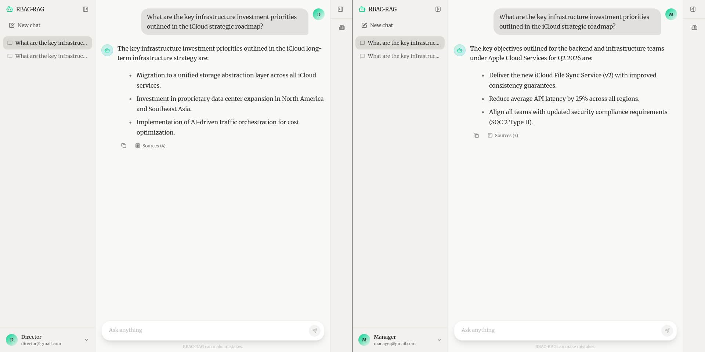

    

## Overview

RBAC-RAG is a comprehensive, secure knowledge management platform designed for enterprise environments. It solves the challenge of making vast amounts of organizational knowledge searchable and accessible while strictly enforcing **Role-Based Access Control (RBAC)**.

By combining Retrieval-Augmented Generation (RAG) with robust access control mechanisms, RBAC-RAG ensures that users only receive accurate answers based on documents they are authorized to view. Instead of basic search, users get contextual, synthesized knowledge answers generated by a Large Language Model (LLM).

---

## Key Features

### Knowledge Retrieval (RAG)
*   **Semantic Search:** Documents are chunked and embedded into a vector database (Qdrant), enabling semantic searches that understand the *meaning* of queries, not just keywords.
*   **Contextual Generation:** The system retrieves the most relevant knowledge snippets from proprietary documents and passes them to an LLM for accurate answer generation, drastically reducing hallucinations.

### Role-Based Access Control (RBAC)
*   **Granular Permissions:** Every piece of data and every query result is filtered based on user roles, departments, and explicit permissions managed via PostgreSQL.
*   **Data Segregation:** Users are guaranteed to only see information they are authorized to access, critical for maintaining security in an enterprise setting.

### Modern Web Interface
*   The system features a responsive frontend allowing users to interact with the knowledge base through a clean, intuitive chat interface.

---

## Architecture & Technology Stack

RBAC-RAG is a microservices architecture deployed via `docker-compose`, ensuring scalability and modularity.

### Component Breakdown:
1.  **Frontend (UI):** The client-facing application that handles user interactions and displays results.
2.  **Backend API:** The core business logic layer. It acts as an orchestrator, managing the flow of a query—from validation and RBAC checking to invoking vector search and LLM generation.
3.  **PostgreSQL (Relational DB):** Stores structured data, including user profiles, roles, permissions (RBAC mappings), and metadata about indexed documents.
4.  **Qdrant (Vector Database):** Specialized database for storing document embeddings (vectors). It handles the fast retrieval of semantically similar knowledge chunks.
5.  **Ollama (LLM Provider):** Hosts local Large Language Models (LLMs), which receive the retrieved context and formulate the final, coherent answer text.

---

## Local Development

* [Backend API Setup](./backend/README.md)
* [Frontend UI Setup](./frontend/README.md)

### Accessing the Application
Once setup is complete, the services will be accessible at the following ports:

*   **Frontend UI:** `http://localhost:5173` (The main user interface)
*   **Backend API:** `http://localhost:8000` (For developers or programmatic access to the core logic)

## Licensing

The `RBAC RAG` is licensed under the GPLv3 license.
